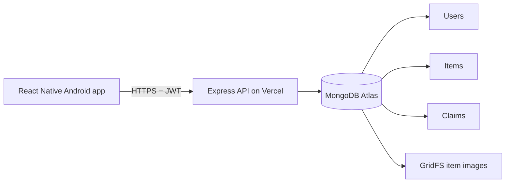
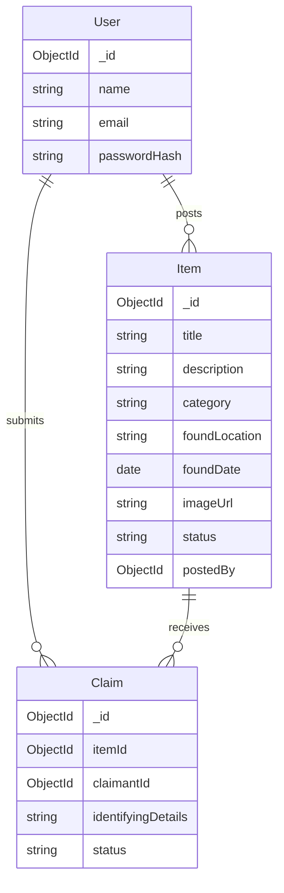

# Architecture and data rules

`User` is authentication context and does not count toward the two required entities. `Item` is primary; `Claim` is related. Claim details are private to the claimant and item poster.

New items start `Available`. Claims start `Pending`. The claimant may edit or cancel a pending claim; the poster may approve or reject it. Approval and item return happen in one MongoDB transaction. Other pending claims become `Rejected`, and a partial unique index allows at most one `Approved` claim per item. Approved claims cannot be deleted. Items with claims cannot be deleted until their non-approved claims are removed.

Image upload uses Multer with a 3 MB limit, validates file signature, and stores the file in Atlas GridFS. Atlas stores `/api/images/:id`; item API responses return the full URL for the current backend host, which the app renders.
